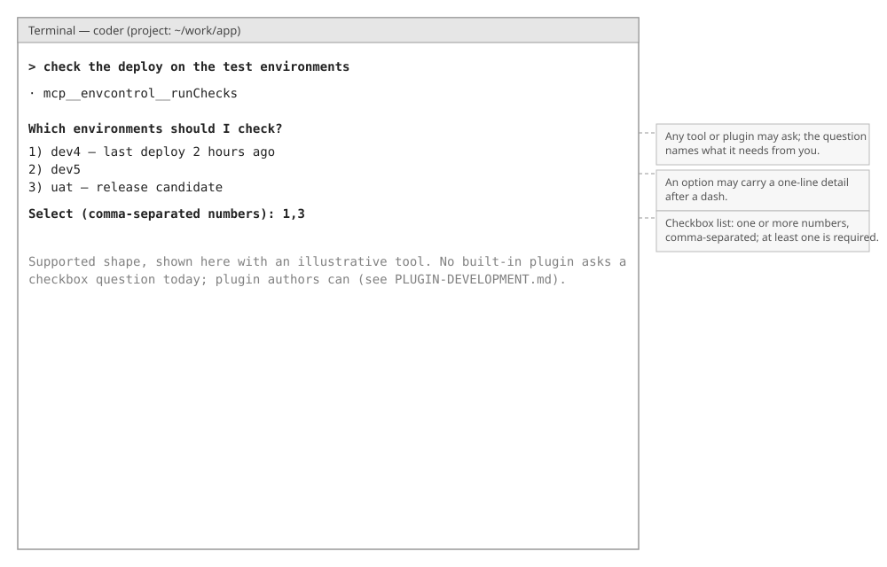

# dmipi-coder — Functional Overview

*A plain-language description of what the agent does, as you see it from the console or from a program that embeds it. No implementation details here; each section links down to its technical companion.*

## What the system is for

You have a local language model server (llama.cpp, LM Studio, vLLM, Ollama or anything else that speaks the OpenAI chat API) and a project on disk. dmipi-coder turns the two into a coding agent: you describe a task in plain words, the agent reads your project, edits files and runs commands, and it stops to ask you whenever a step needs your judgement.

Two ideas shape everything below. The agent is **small enough to audit**: the engine depends on two libraries, Jackson and java-diff-utils, and everything else is the JDK. And it is **made of parts you can leave out**: every ability is a plugin, so what the agent may do is exactly the set of plugins you switch on. An agent without the file plugins cannot see your files. An agent without the shell plugin never runs a command.

## Vocabulary

| Term | Meaning |
|---|---|
| **Core** | The engine library (`agent-core`). It has no user interface of its own. |
| **Front-end** | Whatever you talk to the core through: the console (built) or your own program. |
| **Console** | The terminal front-end (`agent-console`). |
| **Turn** | One prompt and everything the agent does until it answers or stops. |
| **Step** | One model reply inside a turn: some text, some tool calls, or both. |
| **Tool** | One action the model can ask for: read a file, run a command, fetch a page. |
| **Plugin** | A package that adds tools (and sometimes instructions or providers). Every tool comes from a plugin. |
| **Capability** | Something the core lets a plugin do: touch files, run commands, ask you a question. A plugin gets only what it declares. |
| **Question** | A decision the agent hands to you: pick one option, or tick several, with a preview of what is at stake. Also called HIL, human in the loop. |
| **Approval mode** | What happens to an action nobody has approved yet: ask you, run it, or block it. |
| **Permission gate** | The layer every sensitive action passes. It applies the mode, your rules and the hard limits. |
| **Rule** | An allow, ask or deny you configure for a tool and an argument pattern. |
| **Hard limit** | A command refused no matter what: recursive deletion of the root, formatting a disk, a fork bomb. |
| **Sandbox** | The containment a shell command runs in. Three technologies: direct (none), bubblewrap, podman. |
| **Model**, **tier** | One configured language model and its rank: fast, balanced or strong. |
| **Active model** | The model the conversation is using right now. |
| **Session** | A saved conversation you can continue later. |
| **Memory** | Standing notes the agent reads at every start: a user file and a project file. |
| **Skill** | Packaged instructions for one kind of task, loaded on demand. |
| **MCP server** | An external tool server the agent can call over HTTP. |
| **Claude plugin** | A plugin in the Claude Code format: skills and MCP servers, installed by the installer tool. |
| **Subagent** | A helper conversation the agent delegates a subtask to. Only its summary comes back. |
| **Task list** | The checklist the agent keeps for multi-step work, shown in the console. |
| **Plan** | In plan mode, what the agent presents for approval before it may change anything. |
| **Compaction** | Replacing the older part of a long conversation with a summary so it fits the model's window. |
| **User directory**, **project directory** | The two places configuration lives: your home directory, and the project you are working on. |

---

## 1. Talking to the agent

*Layout wireframe — element placement only, not the final visual design.*

The console is one session view: a prompt line at the bottom, the agent's words and actions above it.

**Prompting:**
- You type a prompt at the `>` line and press Enter. That starts a turn. The next prompt is accepted when the turn ends; there is no queue.
- The agent's answer streams as text while it is produced.
- Between the sentences you see one activity line per action (`· read_file scripts/deploy.sh`), followed by what the action produced: a short result line, a diff with + and - colouring for a file change, or the current task list.
- Work delegated to a subagent (§11) shows indented with a `│` prefix, so it reads apart from the main conversation.
- The model's own reasoning ("thinking") is display-only. The console hides it. It is never saved and never shown to the model again.

**Commands:**

| Command | What it does |
|---|---|
| `/plan` | Switch to plan mode (§2). `/plan off` switches back to default. |
| `/resume` | List the saved sessions. `/resume <name>` continues one (§13), before the first prompt of the session. |
| `/llm` | List the configured models, the active one marked. `/llm <name>` switches the active model (§12). |
| `/exit` | Quit the console. |

**Cancelling and endings:**
- Ctrl+C cancels the running turn. The conversation stays usable. When no turn is running, Ctrl+C exits.
- A turn always ends explicitly, one of five ways: the agent answered; it handed the turn back to you after a stalled step (§14); it hit the step limit, and a note says so; you cancelled it; or it failed, and an error line says why. After any of them, your next prompt continues the same conversation.
- The agent never guesses at a decision that is yours. When it needs one, it asks (§2).

> How this works under the hood: see [The Interface — Technical Companion](INTERFACE-TECHNICAL.md) and [The Conversation — Technical Companion](CONVERSATION-TECHNICAL.md).

## 2. Approving what the agent does

*Layout wireframe — element placement only, not the final visual design.*

Every sensitive action passes one permission gate before it runs. The gate decides whether the action runs, is blocked, or is asked about, and the asking is a question to you.

**Questions:**
- A question is one line of plain language, an optional preview shown verbatim (a diff, a command line, a URL, a plan), and numbered options.
- Two shapes: an option list, where you type exactly one number, and a checkbox list, where you type one or more numbers separated by commas. An invalid entry is asked again.
- A question blocks the work that asked it. There is no timeout and nothing answers on your behalf. Cancelling the turn cancels its open question.
- You are never shown two questions at once. Questions from subagent work arrive one after another, in the same shape.

**The permission question:** "Allow the agent to run 'edit — scripts/deploy.sh'?" with three options: *Allow once*, *Always allow this session*, *Deny*.
- *Always allow* is remembered for the rest of the session, for that tool. For a shell command it covers only that exact command line, and the option says so.
- A denied action is reported to the agent as denied. The agent may take another route to the goal but is instructed never to reach the denied action through another tool, a script or an alias.

**Approval modes:** the mode decides the outcome only when no rule and no earlier "always" answer covers the action.

| Mode | Behaviour |
|---|---|
| **Default** | Anything sensitive asks you. Reads and searches never ask. |
| **Plan** | Read-only. Every action that would change something is blocked until you approve the agent's plan. |
| **Allow edits** | File edits run without asking. Everything else (commands, web, installs) still asks. |
| **Allow all** | Everything runs without asking. The sandbox (§4) is most of what remains between an approved command and your machine. |
| **Don't ask** | Never prompts: anything that would have asked is blocked instead. The mode for scripts and CI, where a hanging question would be worse than a refusal. |

The mode starts from your settings (§15) and can be switched at runtime: `/plan` in the console, or a call by an embedding program.

*Layout wireframe — element placement only, not the final visual design.*

**Plan mode, end to end:**
- Switch it on with `/plan`. The agent explores with read-only tools; each attempted edit or command is refused with a message that tells it why.
- When its investigation is done, the agent presents a plan: what to change, which files, what to reuse, how to verify. The plan is the preview of a question with two options: *Approve — start the work* and *Keep planning*.
- Approving switches the mode back to default and the work starts, with edits and commands asked about as usual. *Keep planning* leaves the mode on and the agent revises.

**What no mode changes:**
- A deny rule (§15) holds in every mode, *allow all* included.
- The hard limits hold in every mode and past any answer: recursive deletion of the filesystem root, creating a filesystem on a device, writing to a raw disk device, a fork bomb. They are a backstop against accidents, not a sandbox.

*Layout wireframe — element placement only, not the final visual design.*

**Other questions:** a tool may ask you something that is not a permission, such as which of two places to install into (§10). The shape is the same. The checkbox shape is supported by every front-end; no built-in tool asks one today.

*(planned)* An advisor model may one day pre-screen shell commands so that read-only ones run without asking. It would only ever turn an *ask* into a *run* where you delegated that, never past a deny rule or a hard limit.

> How this works under the hood: see [Permissions — Technical Companion](PERMISSIONS-TECHNICAL.md).

## 3. Reading and editing files

The agent sees only the project directory. Any path that would escape it is refused.

**Reading and searching** (the file-read plugin):
- `read_file` returns a file with numbered lines, in windows of up to 2000 lines; a banner says how much of the file was shown. Very large files are refused, and over-long lines are cut with a marker.
- `list_directory` lists a directory, directories marked with a trailing slash.
- `glob` finds files by pattern (`**/*.java`); build output and version-control internals are skipped.
- `grep_search` searches file contents by regular expression and returns `path:line: text` matches, case-insensitive unless asked otherwise, narrowed by a glob or a directory.
- None of these ask for permission. Every result is capped and says when it was cut, so the agent can narrow its request.

**Editing** (the file-edit plugin):
- `edit` replaces an exact piece of text that must match the file uniquely (or every occurrence, when asked). The agent may paste numbered lines straight from a read; the numbers are ignored.
- `write_file` creates a file or replaces its whole content, and says which of the two it did.
- Both ask you first, with the diff as the preview, unless the mode or a rule says otherwise. After an edit, the agent is shown the changed region so it can check its own work.
- The agent must read a file before editing it: an edit to a file it has not read in this session is refused with a message telling it to read first. Creating a new file needs no prior read.

**Leaving file access out:** register only the file-read plugin and you have a read-only agent. Register neither and the agent cannot see your files at all; it can still do whatever the other plugins allow.

> How this works under the hood: see [Plugins — Technical Companion](PLUGINS-TECHNICAL.md), §5.

## 4. Running commands

`run_shell_command` runs a command in the project directory and returns its exit code, standard output and standard error, each labelled, with `(empty)` where there was nothing.

**Behaviour:**
- Every command asks you first, with the command line as the preview, unless a rule, an earlier "always" for that exact command, or the *allow all* mode covers it.
- The agent is instructed to prefer the dedicated tools (read, edit, search) over shell equivalents, so what it does stays reviewable.
- A command has a default timeout of two minutes and may ask for up to ten; a command that overruns is killed and its partial output returned. Both bounds are configurable (§15).
- Output is capped so a chatty command cannot flood the conversation.
- A long-running command (a server, a watcher) can be started in the background; it returns at once with a handle and is stopped when the session ends.

**The sandbox:** every command runs inside the configured containment technology. You pick it in settings (§15).

| Technology | What it does |
|---|---|
| **direct** | No confinement. The command runs as you, on your machine. The agent is told so, honestly. This is the default. |
| **bubblewrap** | The command may write only the project directory, the additional directories you list, and a private temporary area; the rest of the machine is read-only. Optional memory and process limits. |
| **podman** | Each command runs in a fresh container of an image you choose, with the project and the additional directories mounted writable. Your host tools are not visible: the image must carry the build tools the project needs. Optional memory and process limits. |

**Network:** by default a command sees your network unrestricted. A program that embeds the core can cut the network entirely, or route it through a control point that lets listed hosts pass and asks you about any other host at connect time ("The command wants to reach registry.npmjs.org — allow?"), with *always* and *deny* remembered for the session. Both need a confining technology; the console does not expose either setting yet.

**Honesty:** the agent is told whether it is inside a sandbox, and which fences hold. A technology that cannot honour the requested confinement refuses to start rather than pretending.

> How this works under the hood: see [Sandbox — Technical Companion](SANDBOX-TECHNICAL.md).

## 5. Reading the web

`web_fetch` takes a URL and a question ("what does this page say about retries?") and returns a summary that answers the question.

- It asks you first, with the URL as the preview.
- Only http and https URLs; addresses on your private network, your own machine, or that do not resolve are refused, at every redirect.
- The page is stripped of markup, cut to a bounded size, and summarized by the fastest configured model in a separate context. The raw page text never enters your conversation, so a page cannot talk to the agent directly.

> How this works under the hood: see [Plugins — Technical Companion](PLUGINS-TECHNICAL.md), §6.

## 6. Planning and task lists

- For work that takes more than a couple of steps the agent keeps a task list (`todo_write`). The console shows it after every update, with `[ ]` pending, `[~]` in progress and `[x]` completed. Updating the list never asks for permission.
- In plan mode the agent presents its plan for approval (`present_plan`), as described in §2. Outside plan mode the tool does nothing.
- Both belong to the main conversation only; a subagent never keeps a task list or presents a plan.

> How this works under the hood: see [Permissions — Technical Companion](PERMISSIONS-TECHNICAL.md), §5.

## 7. Memory

Memory is standing knowledge the agent has at the start of every session: plain markdown files you own, read into its instructions.

**Files and scopes:**

| Scope | File | Applies |
|---|---|---|
| **User memory** | `.coder/CODER.md` in your home directory. | In every project. |
| **Project memory** | The first of `CODER.md`, `AGENTS.md`, `CLAUDE.md` in the project directory. | In that project. Existing repositories with an `AGENTS.md` or `CLAUDE.md` work as they are. |

- A line holding only `@path` pulls another file in, relative to the memory file, staying inside the same scope. Imports nest a few levels and never loop.
- User memory loads first, project memory last; where they disagree, the more specific wins.

**Saving:**
- "Remember: never touch the generated files" makes the agent save through the `memory` tool. It reads the file first and writes the complete updated content.
- A project-scope save is treated like a file edit: it asks in default mode, runs without asking in *allow edits*. A user-scope save always asks (except in *allow all*), because it affects every future session in every project. The diff is the preview.
- A saved change applies from the next session; the current conversation already knows it, because you just said it.
- Reading memory never asks.

**Discipline:** memory is paid for in every request. Keep it to rules and pointers; put detail in ordinary files the agent reads on demand.

*(planned)* Project memory walked from the project directory up to the repository root, so a monorepo subproject inherits repository-wide memory.

> How this works under the hood: see [Plugins — Technical Companion](PLUGINS-TECHNICAL.md), §7.

## 8. Skills

A skill is a folder with a `SKILL.md`: packaged instructions for one kind of task, in the same layout Claude Code uses.

- Skills live under `.coder/skills/<name>/SKILL.md` in your home directory (available everywhere) and in the project directory (this project). A project skill replaces a user skill of the same name.
- The file starts with a small header naming the skill and describing it in one line; the rest is the instructions. A file without the header still loads, named after its folder.
- The agent sees one `skill` tool whose description lists every skill with its one-line description. When a task matches, the agent loads the skill and receives the full instructions, plus the skill's folder so that files it refers to can be found. Loading never asks.
- No skills found means no tool: the agent is not told about a feature it cannot use. A broken skill file is skipped with a warning and does not stop the session.

> How this works under the hood: see [Plugins — Technical Companion](PLUGINS-TECHNICAL.md), §8.

## 9. MCP servers

An MCP server is an external tool server. Declare one and its tools appear in the agent's tool list.

- Servers are declared in `.mcp.json` at the project root, and in `.coder/.mcp.json` in your home directory for every project. On a name clash the project's declaration wins. The file format is in the [User Manual](USER-MANUAL.md#9-mcp-servers).
- Only HTTP servers are supported. A server of another transport is skipped with a warning, so a shared configuration can list transports the agent does not speak. A malformed file stops startup with a message naming the file.
- Each remote tool appears as `mcp__<server>__<tool>`, with the description and parameters the server advertised. A tool the server marks read-only runs without asking; any other asks you, is blocked in plan mode, and is not softened by *allow edits*.
- A server that cannot be reached at startup is skipped with a warning; the session starts without its tools.

> How this works under the hood: see [Plugins — Technical Companion](PLUGINS-TECHNICAL.md), §9.

## 10. Installing Claude plugins

The installer brings skills and MCP servers from the Claude Code plugin ecosystem into the native layout, so §8 and §9 pick them up.

- `install_plugin` takes a git URL or a local directory. A marketplace repository holds one plugin per top-level folder; name the folder to pick one. Skills are copied under `.coder/skills`, MCP servers are merged into the scope's MCP file. Agents, commands, hooks and output styles are not supported and are reported as skipped.
- Where to install: your home directory (every project) or this project. When the request did not say, the agent asks you directly.
- Installing asks for permission: it runs git and writes files.
- Every install is recorded in `.coder/installed-plugins.json` under the chosen scope. `list_plugins` shows what is installed where, with the skills and servers each brought, and reports hand-written skills separately. `remove_plugin` deletes exactly what its install recorded, after asking, and asks which scope when the plugin is installed in both.
- Installed and removed content takes effect at the next session start.

> How this works under the hood: see [Plugins — Technical Companion](PLUGINS-TECHNICAL.md), §10.

## 11. Delegating to subagents

For open-ended work whose steps would flood the conversation ("find where retries are configured"), the agent hands the task to a subagent and gets back only a summary.

- The `task` tool names a type and gives the complete task. Two built-in types: **explore** (finds things in the codebase; runs on the fastest model) and **review** (judges code or a change; runs on the strongest model).
- A subagent is a fresh conversation with its own, smaller step budget. It sees the same tools as the main agent except the delegation tool itself (no subagents of subagents), the task list and the plan tool. Its actions stream to the console with the `│` prefix.
- The same gate applies: a subagent's edit or command asks you exactly as the main agent's would. Cancelling the turn cancels the subagent and any question it had open.
- Only the subagent's final message reaches the main conversation. Its reads and searches do not.
- One subagent runs at a time. *(planned)* Parallel subagents.

> How this works under the hood: see [Plugins — Technical Companion](PLUGINS-TECHNICAL.md), §11, and [The Conversation — Technical Companion](CONVERSATION-TECHNICAL.md), §6.

## 12. Models

The agent talks to one or more configured models. Each is declared with a name, a protocol, an endpoint, a tier and a context window size.

- The console has a built-in model named `local` pointing at `http://localhost:8080/v1`, tier balanced, 128k window. Declare a model named `local` in your settings to replace it, or declare others alongside it. The file format is in the [User Manual](USER-MANUAL.md#3-configuring-models).
- The first declared model is active at start. `/llm` lists the models; `/llm <name>` switches the active one, mid-conversation if you like.
- The **tier** is a label you give (fast, balanced, strong), an ordering within your own set. The conversation uses the active model. Quick internal checks (the stalled-step check of §14, the web-page summary of §5) use the fastest. Subagent types ask for "at least" a tier. Compaction (§14) uses the active model, because a poor summary would poison everything after it.
- Optional per-model settings: an API key taken from an environment variable, whether the model's thinking is on, whether it accepts schema-constrained replies, and how long a silent stream may stay silent before the turn fails (15 minutes by default; slow generation never trips it, only a dead connection does).
- A model whose protocol no provider speaks, or whose key variable is not set, stops startup with a clear message.
- The only built-in protocol is the OpenAI chat-completions API with streaming, which most local servers speak. Another protocol is another provider plugin.

> How this works under the hood: see [LLM — Technical Companion](LLM-TECHNICAL.md).

## 13. Sessions

- The console autosaves the conversation after every turn, under `.coder/sessions/` in the project, as `session-<date-time>.json`.
- At start the console lists the saved sessions. `/resume <name>` continues one; it must be the first thing you do, before any prompt.
- A resumed session tells you whether the model's cached prompt could be reused ("prompt reused, cache warm") or had to be rebuilt because the tools, plugins, model or environment changed since the save.
- What is saved is the dialogue: your prompts, the agent's words, its tool calls and results. Thinking is never saved. History that was compacted away (§14) stays compacted.

> How this works under the hood: see [The Conversation — Technical Companion](CONVERSATION-TECHNICAL.md), §7.

## 14. Long conversations

The conversation must fit the model's window, and a local model must be kept from wandering. Four mechanisms, all visible when they act.

- **Step limit.** A turn stops after a fixed number of steps (40 by default) with a note; your next prompt can tell the agent to continue.
- **Loop detection.** The same tool call with the same arguments, again and again, stops the turn with a note instead of burning the window.
- **Stalled-step check.** Local models often announce work and stop ("I will now edit the file." and then silence). The console asks the fastest model one isolated question: whose turn is it? If the agent's, it is nudged once to continue; a second stall hands the turn back to you.
- **Compaction.** When the history reaches 70% of the active model's window, the older part is replaced by a state snapshot written by the active model: what was asked, what was decided, which files were touched, what remains. The recent exchanges stay verbatim, and the console prints a note with the before and after sizes. Switching to a model with a smaller window may trigger it at once. If the history still does not fit, the turn fails visibly rather than silently dropping anything.

Also, every tool result is capped, and exploration can be pushed into a subagent (§11), so the window fills slowly in the first place.

*(planned)* A command to compact on demand.

> How this works under the hood: see [The Conversation — Technical Companion](CONVERSATION-TECHNICAL.md), §4 and §5.

## 15. Configuration

Configuration lives in two places, called the anchors: your **user directory** (home) for what applies everywhere, and the **project directory** (where the console was started) for this project.

- Each anchor may hold `.coder/settings.json`. The console reads both; where both speak, the project wins. The same precedence holds for skills, MCP servers and memory.
- Settings carry: the models (§12), the starting approval mode (§2), the sandbox technology and the additional directories commands may write (§4), the shell timeouts (§4), and permission rules.
- **Permission rules** decide an action before the mode does: each names a tool (or `*` for any), an argument pattern with `*` wildcards matched against the whole command line or path, and *allow*, *ask* or *deny*. When several rules match, the strictest wins. An allow rule turns an ask into a run; a deny rule holds in every mode.
- A missing settings file changes nothing. A malformed file or an unknown value stops startup with a message naming the file and the key.
- The agent is told a few facts about its environment: the working directory, the operating system, the model name and whether the project is a git repository. The current date reaches it as a reminder with each request.

The exact file format, with every key, is in the [User Manual](USER-MANUAL.md#3-configuring-models).

## 16. Choosing what the agent may do

The agent is assembled from plugins, and the set you register is exactly what it can do. Nothing is on by default.

| Leave out | And the agent can no longer |
|---|---|
| The file-edit plugin | Change any file. Reads still work: a read-only agent. |
| Both file plugins | See your files at all. |
| The shell plugin | Run any command. |
| The web plugin | Reach any web page. |
| The MCP plugin | Call any external tool server, whatever `.mcp.json` says. |
| The installer plugin | Install or remove Claude plugins. |
| The subagents plugin | Delegate. |
| The memory plugin | Read or write memory files. They are simply never opened. |
| The skills plugin | Load skills. |
| The planning plugin | Keep a task list or leave plan mode by presenting a plan. |

- Each plugin declares the capabilities it needs and receives only those. A plugin that never declared file access cannot reach a file, whatever else is registered.
- Plugins never depend on each other. Removing one never breaks another; the model simply loses those tools.
- The sandbox technologies and the model protocol are plugins too, chosen explicitly by name in settings.
- In the console the plugin set is fixed in its startup wiring; changing it is a one-line edit. A program embedding the core registers whatever it wants. Every plugin, its tools and what removing it costs are listed in the [Plugin Catalog](PLUGIN-CATALOG.md); how to write one is in the [Plugin Development Guide](PLUGIN-DEVELOPMENT.md).

> How this works under the hood: see [Plugins — Technical Companion](PLUGINS-TECHNICAL.md).

---

## Built and planned, at a glance

| Area | Built | Planned |
|---|---|---|
| Front-ends | Console; headless embedding from code. | Web front-end. |
| Approval | Five modes, rules, hard limits, session "always", plan approval. | Advisor model pre-screening read-only shell commands. |
| Files, shell, web | All tools above; three sandbox technologies; network isolation and controlled egress for embedders. | Network settings in the console's settings file; a check at start that a disallowed host is really unreachable. |
| Memory, skills, MCP, installer | All of §7 to §10. | Project memory walked up to the repository root. |
| Subagents | Sequential, two built-in types, custom types from code. | Parallel subagents. |
| Long conversations | Step limit, loop detection, stalled-step check, automatic compaction. | Compaction on demand. |
| Sessions | Autosave, resume before the first prompt, cache-warm resume. | Resume mid-conversation. |
| Models | OpenAI-compatible streaming, tiers, per-model options, idle guard. | Extracting thinking written inline in the answer text; tool calls written as text by models without native tool calling (recorded, not planned). |
