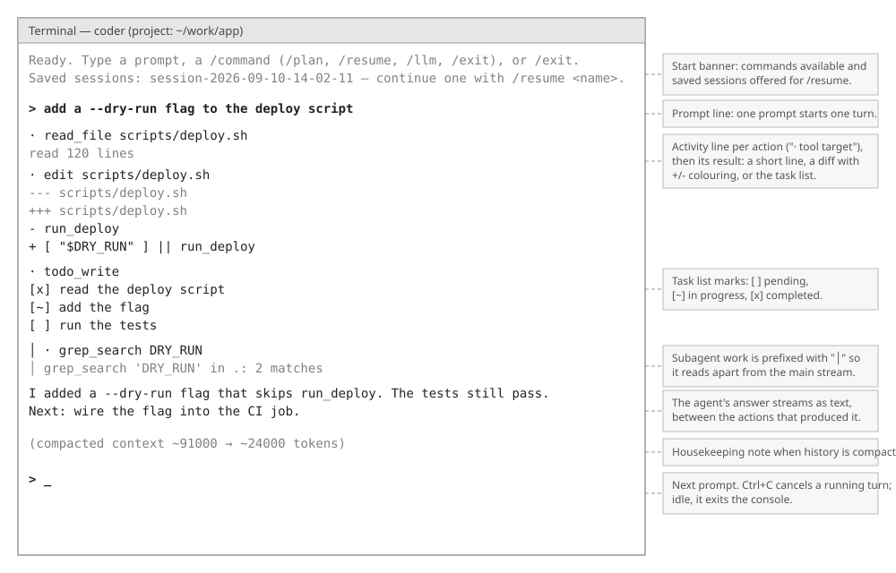

# The Interface — Technical Companion

*Technical side of [FUNCTIONAL-OVERVIEW.md §1](FUNCTIONAL-OVERVIEW.md#1-talking-to-the-agent) and of the question mechanism behind [§2](FUNCTIONAL-OVERVIEW.md#2-approving-what-the-agent-does). Same plain style, but here we explain the implementation: the three channels, their types, and how the console renders them.*


*Layout wireframe — element placement only, not the final visual design.*

## 1. The idea in one paragraph

The core is a library with no user interface. Any front-end connects through exactly three channels: **in** (one prompt per turn), **out** (one ordered stream of typed events) and **HIL** (a question the core asks and blocks on until answered), plus a handful of functions on the `Coder` facade for models, modes and sessions. The console is a thin rendering of those three channels, with slash commands as sugar over the facade functions. Nothing in the core knows whether it talks to a terminal, a browser or a test. A front-end that ignores every out event still yields a correct, if silent, agent; a front-end that answers every question by policy yields a headless one.

## 2. Data model

**The channels** (`domain/agent/In`, `domain/event/Out`, `domain/hil/Hil`):

| Channel | Type | Direction | Blocking |
|---|---|---|---|
| in | `In.nextPrompt(): Optional<String>` | front-end → core | The core asks between turns only; empty ends the session. Optional: a front-end may instead call `Coder.runTurn` itself, as the console does. |
| out | `Out.event(OutEvent)` | core → front-end | Never. Fire-and-forget, in the order things happened. |
| HIL | `Hil.ask(Question): Answer` | core → user → core | Always. The asking work waits; no timeout. |

**Out events** (`OutEvent`, sealed):

| Event | Fields | Meaning |
|---|---|---|
| `ThinkingDelta` | `text` | A piece of the model's reasoning stream. Display-only, transient. |
| `AnswerDelta` | `text` | A piece of the agent's words to the user. |
| `ActivityStarted` | `action`, `summary` | A tool call began; `action` is the tool name, `summary` one line of what it targets. |
| `ActivityFinished` | `action`, `display` | The call succeeded, with a display payload. |
| `ActivityFailed` | `action`, `error` | The call failed; the model sees the error and the turn continues. |
| `TurnStarted` | | A turn began. |
| `TurnEnded` | | A turn ended normally: answered, handed back, step limit, or cancelled. |
| `TurnFailed` | `error` | A turn aborted with an error. The conversation stays usable. |
| `ContextCompacted` | `approxTokensBefore`, `approxTokensAfter` | Housekeeping: the older history was summarized. |

**Display payloads** (`Display`, sealed): `Text(text)`, `Diff(unifiedDiff)`, `Todo(items)` where each item is `(text, status)` and status is `PENDING`, `IN_PROGRESS` or `COMPLETED`. The core never sends presentation; the front-end styles each kind.

**Questions** (`Question`, `Option`, `Answer`, `QuestionKind`):

| Field | Type | Set by | Purpose |
|---|---|---|---|
| `question` | text, non-blank | the asker | One line of plain language. |
| `preview` | text, may be empty | the asker | Exactly what is at stake, rendered verbatim: a diff, a command line, a plan. |
| `kind` | `OPTION_LIST` or `CHECKBOX_LIST` | the asker | Exactly one, or one or more. |
| `options` | at least 2 `Option(id, label, detail)` | the asker | The closed set. `id` is never shown; `label` is; `detail` is an optional second line. Ids are unique within a question. |
| `Answer.selected` | list of ids, never empty | the front-end | The chosen option ids. |

`Question.rejection(answer)` says why an answer does not fit: unknown id, duplicate, wrong count for an option list. The core enforces it: an invalid answer from a front-end is a loud failure in the core, never an accepted guess.

**The facade** (`api/Coder`): `runTurn(prompt, cancelToken)`, `run()` (pulls from `In`), `cancelCurrentTurn()`, `models()`, `activeModel()`, `activateModel(name)`, `mode()`, `switchMode(mode)`, `sessions()`, `saveSession(name)`, `resumeSession(name): ResumeResult`, `close()`.

## 3. How the console is wired

```
 ConsoleMain
   │  builds Coder: standard instructions, environment, examples, reminders,
   │  settings (user then project), sessions, every built-in plugin
   ▼
 Console ──── read a line ────▶ SlashCommand.dispatch? ──yes──▶ Coder.switchMode / resumeSession / activateModel
   │                                   │ no
   │                                   ▼
   │                          Coder.runTurn(line, new CancelToken())
   │                                   │
   │            ┌──────────────────────┼──────────────────────┐
   │            ▼                      ▼                      ▼
   │     ConsoleRenderer (Out)   ConsoleHil (Hil)     renderer.forSubagents() (subagent Out)
   │     answer text, "· action",  numbered options,    every line prefixed "  │ "
   │     +/- diffs, [ ] [~] [x],   verbatim preview,
   │     dimmed thinking (off)     shape enforced
   │
   └── after the turn: Coder.saveSession(autosave name)
```

- `ConsoleRenderer` writes each event kind in its own style and nothing else. It closes a half-written answer line before an activity line, and its subagent variant shares the same writer and line state so the two streams never glue together. ANSI colour is used only when standard output is a terminal.
- `ConsoleHil` prints the question, the preview indented by four spaces, the options numbered from 1, and reads a line. It parses numbers (comma-separated for a checkbox list), rejects anything outside the shape, and asks again. It maps numbers back to option ids and never interprets what an option means. Standard input closing while a question is open is an error, not a default answer.
- `SlashCommand` is an enum of `/plan`, `/resume`, `/llm`, `/exit`; each maps to one facade call and the core never sees the command text. A failing command prints `(/name failed: reason)`.
- `Console` installs a SIGINT handler: during a turn it calls `cancelCurrentTurn()`; idle, it exits. Every turn ends with an autosave under a fixed-width, nanosecond-stamped name chosen at start.

## 4. Flows

**One turn through the channels:**

```
 user types "add a flag" ──▶ Console ──▶ Coder.runTurn
                                             │
                                  out: TurnStarted
                                  out: AnswerDelta*            ("I'll read the script first.")
                                  out: ActivityStarted(read_file, scripts/deploy.sh)
                                  out: ActivityFinished(read_file, Text("read 120 lines"))
                                  out: ActivityStarted(edit, scripts/deploy.sh)
                                  hil: ask(Question "Allow the agent to run 'edit — …'?", preview = diff)
                                       ◀── Answer("allow-once")             ← the turn waits here
                                  out: ActivityFinished(edit, Diff(…))
                                  out: AnswerDelta*            ("Done. Next: …")
                                  out: TurnEnded
```

Ordering is meaning: an activity sits between the sentences that caused it; a thinking delta precedes the answer it produced.

**A question, end to end:**

```
 asker (gate / tool / plugin / egress policy)
   │  new Question(text, preview, kind, options)
   ▼
 Coder's shared Hil ── one lock: never two questions at once ──▶ front-end Hil.ask
   │                                                                │ renders, enforces shape
   ◀──────────────────────── Answer(ids) ───────────────────────────┘
   │  Question.rejection(answer) checked (plugins: loudly; the gate: treated as deny)
   ▼
 the asker alone interprets the ids ("allow-always" ⇒ remembered by the gate, the front-end never knows)
```

**Cancel:** Ctrl+C → `cancelCurrentTurn()` → the turn's `CancelToken` is set → the loop stops at the next check, skips remaining tool calls (each still gets a "cancelled" result so the history keeps its call/result pairing), and emits `TurnEnded`. A question open on the console's own thread is answered by the user or ends with the process; questions are never answered by cancellation on the user's behalf.

## 5. Building another front-end

A front-end implements `Out` and `Hil` (and optionally `In`), then calls the facade. Checklist:

- Render every `OutEvent` kind, or deliberately drop some (thinking is the usual drop).
- Render `Question` faithfully: text, preview verbatim and monospaced, options in order. Enforce the shape before returning. Never add, rewrite or filter options, and never answer yourself.
- Map your own commands onto facade calls; add no behaviour of your own.
- Pass `subagentOut` if you want delegated work shown apart; otherwise those events are dropped.

**Headless** (tests, CI): supply prompts from code, capture `Out` in a list, answer `Hil` by policy. Combine a deny-everything policy with `Mode.DONT_ASK` for full non-interactivity: the gate then blocks instead of asking, and only non-permission questions (a tool asking where to install) reach the policy. The test fixtures `RecordingOut` and `ScriptedHil` in `agent-core`'s tests are exactly this.

**Web** *(planned)*: nothing web-specific may enter the core. The channels are already transport-shaped: typed events out, questions with stable option ids in. Sessions, users and auth would be the web app's own concerns.

## 6. Boundaries and guarantees

- The core owns content and rules; the front-end owns presentation. No presentation string originates in the core beyond the event payloads.
- `Out` is never blocking and never waited on. A slow renderer slows the loop only by the time its `event` call takes.
- The user is never shown two questions at once: the core wraps the front-end's `Hil` in one lock shared by the gate, plugins and the egress proxy threads.
- An answer outside the offered set is rejected by the core; askers may rely on the closed set.
- A question never outlives the work that asked it: cancelling the turn stops the loop, and no answer is fabricated.
- Thinking is never saved in a session and never sent back to the model.
- Slash commands are sugar: everything they do is reachable through the facade, and nothing is reachable only through them.
