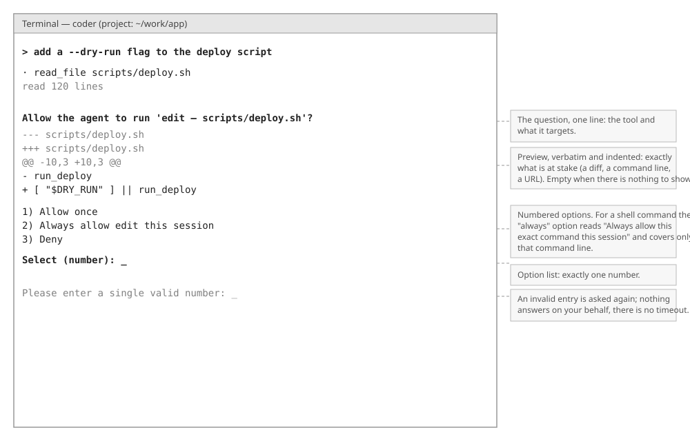
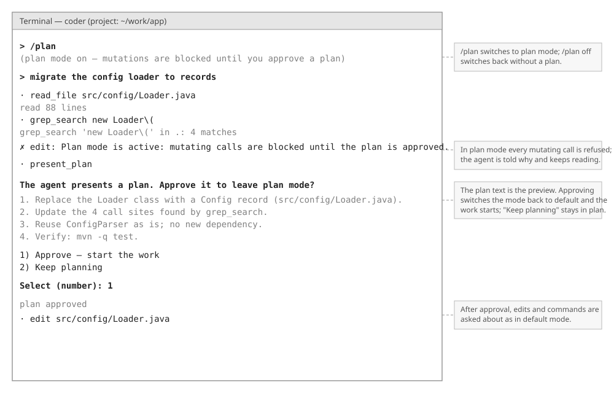

# Permissions — Technical Companion

*Technical side of [FUNCTIONAL-OVERVIEW.md §2](FUNCTIONAL-OVERVIEW.md#2-approving-what-the-agent-does) and of the plan flow in [§6](FUNCTIONAL-OVERVIEW.md#6-planning-and-task-lists). Same plain style, but here we explain the implementation: the gate's decision order, what "always" remembers, and how plan mode is left.*


*Layout wireframe — element placement only, not the final visual design.*

## 1. The idea in one paragraph

One non-removable layer in the core, the `PermissionGate`, sees every tool call before it runs, whether the model or a subagent asked for it. It composes the tool's own baseline (allow, ask or deny for this call) with a plugin policy that can only tighten, checks the operator's rules and the hard limits, applies the active mode to whatever would ask, remembers "always this session" answers, and raises the question through the HIL channel with the tool's preview. Plugins cannot remove or relax it; a mode only decides what happens to an *ask*; a deny and a hard limit hold everywhere.

## 2. Data model

| Type | Values or fields | Set by | Purpose |
|---|---|---|---|
| `Mode` | `DEFAULT`, `PLAN`, `ALLOW_EDITS`, `ALLOW_ALL`, `DONT_ASK` | settings, `/plan`, embedder | The ask outcome: `PROMPT` for default, plan and allow-edits; `RUN` for allow-all; `BLOCK` for don't-ask. |
| `PermissionDecision` | `ALLOW` < `ASK` < `DENY` | tools, policies, rules | Ordered by strictness; `tightenedBy` picks the stricter, which is the only way decisions compose. |
| `ToolKind` | `READ`, `SEARCH`, `EDIT`, `EXECUTE`, `NETWORK`, `OTHER` | each tool, per call via `kind(params)` | `mutates()` is true for `EDIT` and `EXECUTE`. |
| `PermissionRule` | `toolName` (or `*`), `argumentGlob`, `decision` | settings `permissions[]`, `Builder.permissionRule` | Matches when the tool name fits and the glob matches the **whole** of `Tool.matchTarget(params)`; `*` is any run of characters. |
| `PermissionPolicy` | `decision(params)` | a plugin, with its tool | Composed by tightening only. |
| `HardLimits` | a fixed list of command patterns | the core | Refused past everything, for `EXECUTE` calls only. |
| `GateDecision` | `Allowed` or `Denied(reason)` | the gate | What the loop does: run the tool, or feed the reason back to the model as the tool result. |
| `SessionApprovals` | a set of scope strings | the gate | The "always" memory. |

The gate reads three things from a tool per call: `kind(params)`, `defaultPermission(params)`, and `matchTarget(params)` (the full command line or path, never an abbreviated display line). It shows two: `callSummary(params)` in the question text and `preview(params)` as the preview.

## 3. The decision, in order

```
 decide(tool, params)
   │
   ├─ 1. HardLimits.refusal?            EXECUTE call matching a catastrophic pattern ──▶ Denied (reason)
   ├─ 2. mode == PLAN and kind mutates?                                             ──▶ Denied ("Plan mode is active…")
   ├─ 3. rules.decisionFor == DENY?      strictest matching rule                    ──▶ Denied ("A settings rule denies this call.")
   ├─ 4. composed = baseline tightenedBy policy
   │      then softened: ALLOW_EDITS and kind == EDIT and composed == ASK ⇒ ALLOW
   │      composed == DENY?                                                         ──▶ Denied
   ├─ 5. rules.decisionFor == ALLOW?     converts an ASK into ALLOW, never past 1–4
   │
   └─ 6. final decision
          ALLOW ──────────────────────────────────────────────────────────────────▶ Allowed
          ASK ──▶ mode.askOutcome()
                   RUN    (allow all) ────────────────────────────────────────────▶ Allowed
                   BLOCK  (don't ask) ────────────────────────────────────────────▶ Denied
                   PROMPT ──▶ approvals.isApproved(scope)? ──yes──────────────────▶ Allowed
                              │ no
                              ▼
                        hil.ask("Allow the agent to run '<tool — summary>'?", preview,
                                Allow once · Always allow … · Deny)
                              allow-once ──▶ Allowed
                              allow-always ──▶ approvals.approve(scope) ──▶ Allowed
                              deny / invalid answer ──▶ Denied
```

Two consequences worth spelling out. An operator *allow* rule cannot rescue a call the plan mode, a deny rule, a policy or a hard limit rejected: it is consulted only at step 5. And *allow edits* softens exactly one thing, an `EDIT` call that would have asked; a user-scope memory save reports `EXECUTE` on purpose so that it is never softened.

**Rules combine by strictness.** `PermissionRules.decisionFor` reduces every matching rule with `tightenedBy`, so among `allow`, `ask` and `deny` matches the deny wins, then the ask. Rules from the user and project settings files are simply concatenated.

## 4. What "always" remembers

The scope of an "always" answer is exactly what its label says:

| Kind of call | Scope string | Label shown |
|---|---|---|
| `EXECUTE` | tool name + the full match target (the exact command line) | "Always allow this exact command this session" |
| every other kind | tool name | "Always allow `<tool>` this session" |

So approving `git status` "always" never silently approves `git push`; approving `edit` "always" approves every edit for the rest of the session, which is what the label promised. The memory lives only in the gate; the front-end never learns that an option had a side effect.

## 5. Plan mode, end to end


*Layout wireframe — element placement only, not the final visual design.*

```
 /plan ──▶ Coder.switchMode(PLAN) ──▶ gate.mode = PLAN
                                        │
   model calls edit ──▶ gate: kind mutates ──▶ Denied("Plan mode is active…") ──▶ model reads it, keeps exploring
   reminders: "Plan mode is active…" appended to each request while the mode holds
                                        │
   model calls present_plan(plan) ──▶ gate: kind OTHER, baseline ALLOW ──▶ runs
        PresentPlanTool: modes.current() == PLAN?  no ──▶ Failure("Not in plan mode…")
                         hil.ask("The agent presents a plan. Approve it to leave plan mode?", preview = plan,
                                 Approve — start the work · Keep planning)
                         approve ──▶ modes.switchTo(DEFAULT) ──▶ Success("Plan approved…")
                         revise  ──▶ Success("The user wants to keep planning…")
```

`present_plan` lives in the planning plugin and uses two capabilities: HIL (to ask) and **modes** (`Modes.current()`, `Modes.switchTo(mode)`, backed by the gate). It is main-only, so a subagent can neither present a plan nor leave plan mode. `/plan off` is the other way out, without a plan.

## 6. Hard limits

`HardLimits` refuses an `EXECUTE` call whose match target contains any of: `rm` with a recursive flag targeting `/` (short or long flags, quotes tolerated), `mkfs`, `dd … of=/dev/…`, a redirect into `/dev/sd*` or `/dev/hd*`, or the classic fork bomb. It is deliberately narrow: a backstop against unmistakable accidents, not a sandbox. Confinement is the sandbox's job ([SANDBOX-TECHNICAL.md](SANDBOX-TECHNICAL.md)). The bundled prompt also teaches the model to avoid such commands; the prompt reduces attempts, the hard limit is the floor.

## 7. Where the gate sits

```
 AgentLoop step ──▶ for each tool call: validate ──▶ gate.decide ──▶ Allowed? execute : result = Denied reason
                                                       ▲
 subagent loop (ConversationsEngine) ─── the same gate instance ───┘
 egress proxy threads ─── EgressPolicy asks its own question through the same serialized Hil
```

- The loop feeds a denial back to the model as the tool result, so the turn continues and the model can choose another route; the bundled instructions forbid reaching a denied action through another tool.
- A subagent's calls pass the identical gate; there is no second policy.
- The egress policy ([SANDBOX-TECHNICAL.md §5](SANDBOX-TECHNICAL.md#5-the-network-contract)) is a second asker with the same three options and its own session memory, sharing the one-question-at-a-time lock.
- Policies attach at wiring time (`PluginRegistrar.registerTool(tool, policy)`), before the first turn.

## 8. Boundaries and guarantees

- The gate is constructed by `Coder.build()` and interposed on every call; no plugin can register without it and no plugin can reach it to relax a decision.
- A `DENY`, from a rule, a policy or a hard limit, holds in every mode and past any answer.
- A mode changes only the outcome of an *ask*.
- A plugin policy can only tighten; the composition is `tightenedBy`, there is no loosening operation.
- The gate alone interprets the permission options; the front-end returns ids.
- **Known gap** (recorded in [OPEN-QUESTIONS.md](OPEN-QUESTIONS.md)): capability calls made by plugin *code* (a plugin reading a file through its file-system capability rather than through a tool call) are confined to the anchor but are not HIL-gated per call. The gate interposes on tool calls; per-call capability gating is an open design point.
- *(planned)* LLM advisors: a fast-tier, isolated classification that may convert an *ask* into a *run* only where configuration delegates it, never past a deny or a hard limit, with "unsure" falling back to the human.
